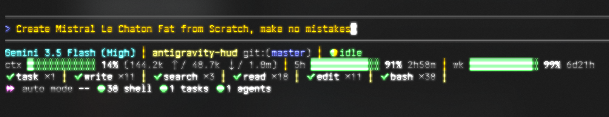

# 🚀 antigravity-hud

[](LICENSE)

> A 4-line statusline HUD for the [Antigravity CLI](https://github.com/google-antigravity/antigravity-cli). Because flying blind through your quota is no way to code.



## The backstory

Whilst building SynCloudOS I burned through my entire [Claude Code](https://claude.ai) and [ChatGPT Codex](https://chat.openai.com) weekly usage limits in about 48 hours. Classic. Then I rediscovered **Google Antigravity**, Google's agentic coding CLI that ships with Gemini models *and* lets you use third-party models like Claude Opus/Sonnet 4.6 through the same interface. More importantly I realised I have been paying for this and really should use it at least once.

The problem? Antigravity's built-in statusline is... minimal. I wanted something that showed me *everything* at a glance: which model I'm burning tokens on, how much quota I have left, what tools the agent is using, and whether I should maybe switch to Gemini 3.5 Flash for that docs task instead of torching premium Claude tokens.
I also wanted a *gamified* interface, one that is addictive, almost slot-machine-like, or maybe slop-machine-like, which is honestly the point, and encourages me to waste my 20s vibe coding, à la Claude.

So I built this. First as a [chaotic PowerShell script](legacy/statusline-syn.ps1), then as a proper cross-platform Node.js CLI.

### When to use what

| Model | Good for |
|---|---|
| **Gemini 3.5 Flash** | Docs, summaries, lighter refactors, brainstorming |
| **Claude Opus 4.6** | Complex bug fixes, architecture, multi-file refactors |
| **Claude Sonnet 4.6** | Feature tests, codebase exploration, code review |

The HUD helps you keep an eye on quota so you can switch models before you hit the wall. 🧱

## Features

- **📊 Quota health bars** - 5-hour and weekly quota with colour-coded bars (quotaHigh, quotaMid, quotaLow, quotaCritical)
- **🔄 Live spinner** - braille-dot animation when the agent is thinking/working/tooling
- **🧰 Tool tallies** - see what the agent has been doing: `✔ read ×5 │ ✔ edit ×2 │ ✔ bash ×3`
- **📐 Adaptive layouts** - automatically adjusts for wide, medium, and narrow terminals
- **🪟 Cross-platform** - Windows, macOS, Linux. One `npm install` and you're done.
- **🎨 Addictive, eye-candy terminal output** - bold, colour, Unicode glyphs. Degrades gracefully with `AGY_HUD_NO_COLOR` and `AGY_HUD_NO_UNICODE`.
- **📜 Transcript parsing** - reads Antigravity's JSONL transcripts to count tool usage per category
- **🔌 Zero dependencies** - pure Node.js built-ins, no npm packages needed at runtime

## Installation

### Quick start

Run the following command to install the package globally and configure it automatically:

**Windows (PowerShell):**
```powershell
npm install -g @phenom64/antigravity-hud; antigravity-hud install
```

**macOS / Linux:**
```bash
npm install -g @phenom64/antigravity-hud && antigravity-hud install
```

**Using npx (no global install required):**
```bash
npx @phenom64/antigravity-hud install
```

The `install` subcommand automatically creates the settings directory if it's missing, patches your `~/.gemini/antigravity-cli/settings.json` file, and creates a timestamped backup of your previous settings (e.g. `settings.json.backup-antigravity-hud-YYYYMMDD-HHMMSS`).

### Verify installation

Run the diagnostics check to verify everything is set up correctly:

```bash
antigravity-hud doctor
```

This will check that the binary is on your PATH, print your current configuration, and render a live sample of the HUD.

### Configuration

You can customize layout presets, toggle features (like cost tracking, streaming speed, or RAM usage), and adjust settings using the interactive CLI wizard:

```bash
antigravity-hud configure
```

This writes your configuration to `~/.gemini/antigravity-cli/antigravity-hud-config.json` with the following schema:

```json
{
  "preset": "full",
  "showCost": true,
  "showSpeed": true,
  "showMemory": true,
  "colorMode": true,
  "unicodeMode": true,
  "colors": {
    "model": "cyan",
    "project": "yellow",
    "git": "brightBlue",
    "label": "gray"
  }
}
```

#### Presets

*   **`full`** (default): The standard 4-line HUD containing everything (model, repo, git, spinner, context, quotas, tool tallies, cost, speed, RAM, and shell stats).
*   **`essential`**: A clean 2-line HUD containing model, repo, git, spinner, context usage, quotas, and toggled metrics (cost/speed/RAM) appended to Line 1.
*   **`minimal`**: A minimal 1-line HUD showing model, repo, git status, spinner, and toggled metrics.

### Uninstalling

To disable the HUD, run:

```bash
antigravity-hud uninstall
```

This will set `enabled: false` in your configuration without destroying other settings, and list your backup files with instructions on how to restore them.

### Manual setup / Legacy helpers

If you prefer to configure manually, edit `~/.gemini/antigravity-cli/settings.json`:

```json
{
  "statusLine": {
    "type": "command",
    "command": "antigravity-hud",
    "enabled": true
  }
}
```

Legacy manual installation scripts are also available under `scripts/install.ps1` and `scripts/install.sh`.


## Commands

The CLI provides commands to query and modify your tool permission settings in `settings.json`.

### Tool Permission Mode

The HUD displays your active tool permission mode in the bottom-left corner (for example, `⏩ auto mode auto`). You can query or change this mode using the `mode` subcommand.

* **Show current mode:**
  ```bash
  antigravity-hud mode
  ```
  Prints the active settings file key (usually `toolPermission`), the raw configuration value, and the corresponding HUD label.

* **Cycle permission modes:**
  ```bash
  antigravity-hud mode next
  ```
  Cycles through the four permission modes: `review` -> `auto` -> `yolo` -> `strict`.

* **Set specific mode:**
  ```bash
  antigravity-hud mode <mode>
  ```
  Sets the tool permission mode. Valid modes are:
  - `review` (maps to `"request-review"`): Asks for permission before executing tools.
  - `auto` (maps to `"proceed-in-sandbox"`): Automatically executes sandboxed/safe tools and prompts for others.
  - `yolo` (maps to `"always-proceed"`): Automatically executes all tools without prompting.
  - `strict` (maps to `"strict"`): Enforces strict permission prompts.

### Keybinding Limitation

Antigravity TUI keybindings only support internal actions. They cannot run external commands. Because of this limitation, you cannot bind Shift+Tab to execute `antigravity-hud mode next` from inside the TUI.

To cycle permission modes, run `antigravity-hud mode next` from a separate terminal window, tmux pane, or shell alias.


## How it works

Antigravity pipes a JSON payload to your statusline command via stdin on every render tick. The payload includes:

- Current model info
- Workspace and project paths
- Context window usage (tokens in/out, window size, percentage used)
- Quota remaining (5-hour and weekly, for both Gemini and third-party models)
- Agent state (idle, thinking, tool_use, etc.)
- Terminal width

The HUD reads this JSON, optionally parses the conversation transcript for tool usage stats, and renders a 4-line ANSI display to stdout.

See [`docs/payload-examples/`](docs/payload-examples/) for example payloads.

## Layout modes

The HUD adapts to your terminal width:

| Layout | Terminal width | Bar length | Tool categories |
|--------|---------------|------------|-----------------|
| `normal` | >= 118 cols | 10-16 blocks | up to 6 |
| `compact` | 92-117 cols | 8 blocks | up to 5 |
| `tiny` | < 92 cols | no bars (% only) | up to 4 |

Override with:
```bash
export AGY_HUD_LAYOUT=compact
```

## Environment variables

| Variable | Values | Description |
|---|---|---|
| `AGY_HUD_LAYOUT` | `normal`, `compact`, `tiny` | Force a specific layout mode |
| `AGY_HUD_NO_COLOR` | `1` | Disable all ANSI colour codes |
| `AGY_HUD_NO_UNICODE` | `1` | Replace Unicode glyphs with ASCII equivalents |
| `AGY_HUD_NO_SPINNER` | `1` | Disable spinner animation (always show ●) |
| `AGY_HUD_TOOL_MAX` | `1`-`10` | Max number of tool categories to display |
| `AGY_HUD_TRANSCRIPT` | path | Point at a specific transcript JSONL (useful for testing) |
| `AGY_HUD_LINKS` | `1` | Enable experimental OSC 8 terminal hyperlinks for project paths and shell logs |

## Output lines explained

```
Line 1:  Model │ repo git:(branch*) │ ● state
Line 2:  ctx [████░░░░] 21% (48k ↑ / 4k ↓ / 250k) │ 5h [████░░] 72% 3h │ wk [█████░] 91% 6d │ ~$0.041 │ RAM 54%
Line 3:  ✔ read ×5 │ ✔ search ×1 │ ✔ edit ×2 │ ✔ bash ×3 │
Line 4:  ⏩ auto mode auto │ ● 3 shell │ ● 1 tasks │ ● 0 agents
```

| Element | Source |
|---|---|
| Model name | `model.display_name` from stdin JSON |
| Repo | basename of `workspace.project_dir` |
| Branch + dirty | `git branch --show-current` + `git status --porcelain` |
| State + spinner | `agent_state`, spinner animates during active states |
| Context bar | `context_window.used_percentage` with token counts |
| 5h / wk quota | `quota.3p-5h` or `quota.gemini-5h` depending on model |
| Cost estimation | `~$0.041` approximate API-equivalent cost (not exact Antigravity billing) |
| Tool tallies | Parsed from conversation transcript JSONL |
| Shell / tasks / agents | Counted from `run_command`, `manage_task`/`schedule`, subagent calls |

### Quota colour thresholds

| Remaining | Colour |
|---|---|
| 50-100% | 🟢 Green |
| 25-49% | 🟡 Amber |
| 15-24% | 🟠 Orange |
| 1-14% | 🔴 Red |
| 0% | ⚠ Limit reached |

## Project structure

```
antigravity-hud/
├── bin/
│   └── antigravity-hud.js    # Cross-platform Node CLI (the main thing)
├── legacy/
│   └── statusline-syn.ps1    # Original PowerShell prototype
├── scripts/
│   ├── install.ps1            # Windows installer
│   └── install.sh             # macOS/Linux installer
├── docs/
│   └── payload-examples/
│       ├── statusline-last.example.json
│       └── transcript.example.jsonl
├── package.json
├── LICENSE                    # MIT
├── CHANGELOG.md
└── README.md                 # You are here
```

## Development

```bash
# Test with a sample payload
cat docs/payload-examples/statusline-last.example.json | node bin/antigravity-hud.js

# Test with the example transcript (skips live transcript search)
cat docs/payload-examples/statusline-last.example.json | AGY_HUD_TRANSCRIPT=docs/payload-examples/transcript.example.jsonl node bin/antigravity-hud.js

# Test with no colour
cat docs/payload-examples/statusline-last.example.json | AGY_HUD_NO_COLOR=1 node bin/antigravity-hud.js

# Test tiny layout
cat docs/payload-examples/statusline-last.example.json | AGY_HUD_LAYOUT=tiny node bin/antigravity-hud.js
```

On Windows PowerShell:
```powershell
# Basic test
Get-Content docs\payload-examples\statusline-last.example.json -Raw | node bin\antigravity-hud.js

# With example transcript
$env:AGY_HUD_TRANSCRIPT="docs\payload-examples\transcript.example.jsonl"
Get-Content docs\payload-examples\statusline-last.example.json -Raw | node bin\antigravity-hud.js
$env:AGY_HUD_TRANSCRIPT=$null
```

## License

[MIT](LICENSE). Go wild.

## Credits
Designed by Kavish Krishnakumar in Manchester - this project is not a part of Syndromatic Limited, it's personal.

Built with ☕, vibes, and mild quota anxiety. Inspired by [Claude HUD](https://github.com/jarrodwatts/claude-hud)'s statusline, but for the Antigravity CLI ecosystem.

If you're reading this, you probably also care about your token budget. Welcome to the club.
